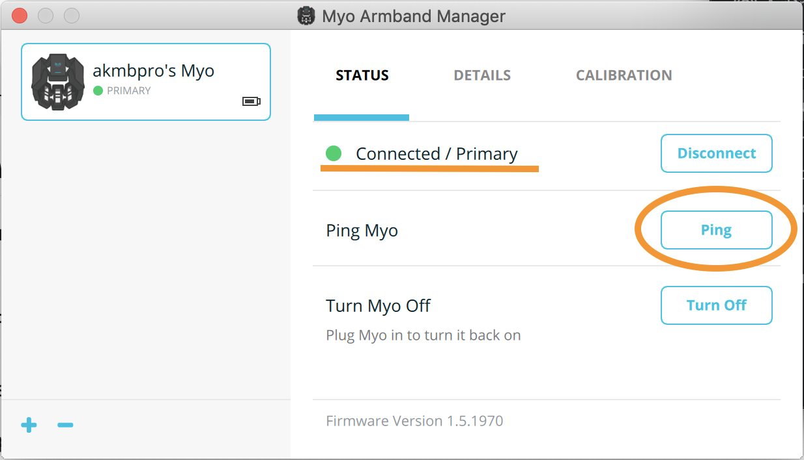

# MYO toolbox for Ecole Centrale de Nantes
 
## Requirements 
- Python 3

The following dependencies will be installed as you follow the installation instructions given below: 
- myo-python
- numpy
- scikit-learn
- matplotlib

## General info:

These codes demonstrate the usage of __myo-python__ library for establishing connection with MYO armband and collecting data from it. 

Historically, the developers of MYO armband have issued an official C++ API to enable the users to create their own armband-based applications. Not long after that, Niklas Rosenstein have developed a Python interface for this API, using CFFI module and CPython. His implementation can be found here: https://github.com/NiklasRosenstein/myo-python. In this project, we build a bit more infrastructure around __myo-python__ library that should help you develop the code for EMG processing and EMG-based gesture recognition.
 
## Installation

### 1. Install MyoConnect

Download MyoConnect from Thalmic's [official web-site](https://support.getmyo.com/hc/en-us/articles/360018409792). Available for Windows and MacOS, a simple installation.

### 2a. New python environment (With Anaconda)

In command line, navigate to the folder with this package. Then run the following command:
```
conda env create -f ./anaconda/myo_environment.yml
```

Now activate the environment that we have just created (its name is 'myo'):
```
conda activate myo
```
__Note:__ please remember that any time you want to run this code from a new command/terminal window, you need to activate the 'myo' environment again.

### 2b. New python environment (Without Anaconda)

...

__Note:__ please remember that any time you want to run this code from a new command/terminal window, you need to activate the 'myo' environment again.

### 3. Install 'myo-python' package

Install it from from my fork on Github. In command line, with 'myo' environment activated, run:
```
pip install git+https://github.com/smetanadvorak/myo-python
```

## How to run the code
### Set up MyoConnect
This should be done only once at the beginning of your working session:

- Insert MYO' Bluetooth dongle in your USB port.
- Run MyoConnect and approach the dongle with your armband. It should automatically get paired with MyoConnect.
- In MyoConnect, press 'Ping' to make sure that it is not connected to some other armband nearby. Your armband should vibrate in response to the ping.

<p align="center">
  
</p>

### Setup the environment and run the code:
- Open command line and activate the 'myo' environment:
```
conda activate myo
```
	
- Navigate to the folder with this package, then to __./examples/streaming__ and run a test script:
```
python emg_streaming.py
```
If everything is installed correctly, a matplotlib figure should appear with the EMG signals being traced in real time. This and other examples can be stopped by either pressing __ctrl-c__  or quicky tapping your middle and thumb fingers against each other twice (see image below): 
	
<p align="center">
  
</p>

## Working with the examples

### EMG streaming

Script [emg\_streaming.py](/examples/streaming/emg_streaming.py) demonstrates a way to collect and plot EMG data from the armband in a real-time manner.

Scripts [1\_dataset_acquisition.py](/examples/classification/1_dataset_acquisition.py), [2\_training.py](/examples/classification/2_training.py) and [3\_inference.py](/examples/classification/3_inference.py) implement a three-step process of EMG data collection, classifier training and testing.

### Gesture classification

In [1\_dataset_acquisition.py](/examples/classification/1_dataset_acquisition.py) may specify the the gestures (variable __gestures__) for which you want to collect the EMG data, as well as how many times to repeat the acquisition (variable __trials\_n__). When you run this script, it guides you through the acquisition by telling which gesture to perform and for which amount of time. The signals are automatically stored in the folder [__data__](/examples/classification/data/). 

__Notes:__ 
- If the script was aborted during data acquisition, on the next run it will continue from where it stooped.
- Empty [__data__](/examples/classification/data/) folder if you want to acquire a new dataset.
- You may expand an existing data set by augmenting __gestures__ and __trials_n__ variables.

In script [2\_training.py](/examples/classification/2_training.py) and utility file [EMG_classification.py](/examples/classification/EMG_classification.py) you may define the parameters of the feature extractor and of the classifier. Default feature is smoothed absolute signal (aka mean absolute value or MAV), default classifier is SVM. Run this code as is to see the results achieved by default setup. The resulting classification model is saved in folder [__models__](/examples/classification/data/). 

Script [3\_inference.py](/examples/classification/3_inference.py) takes the trained classification model and applies in real time to a newly acquired EMG data. Perform gestures in the same way you were performing them during training set acquisition (arm pose matters!). The script will output the label of the gesture in command line. 

### myo-python Examples
Folder [myo_python_examples](/examples/myo_python_examples/) contains the original examples distributed with __myo-python__. They may give you more insights on how to use this library. 

## What's next

Script [emg\_streaming.py](/examples/streaming/emg_streaming.py) can be further modified to implement real-time signal processing, such as filtering or feature extraction. For that, one can add processing in the __while__ loop in 'emg_streaming.py' or redefine/inherit from class EmgBuffer.

Classes __FeatureExtractor__ and __Classification_model__ in [EMG_classification.py](/examples/classification/EMG_classification.py) can be modified to implement a different classifier (ANN, for example). Modify class 'FeatureExtraction' to try other types of features. 
