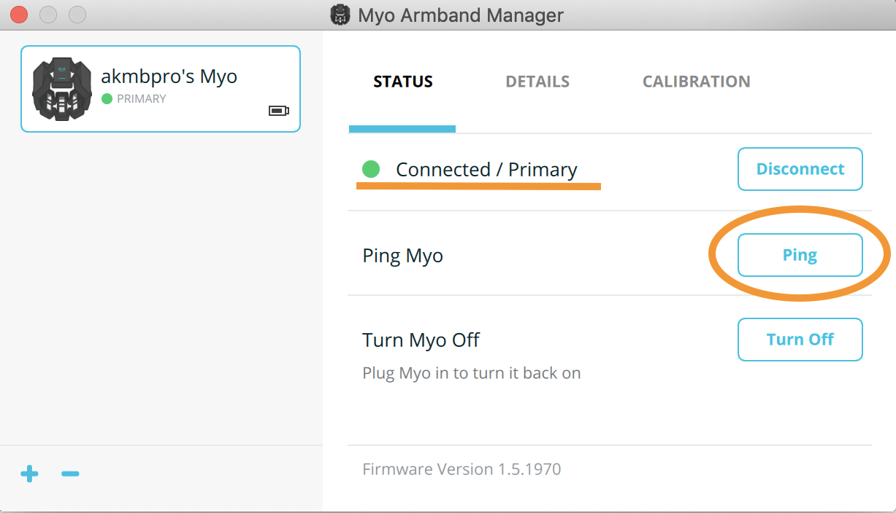
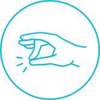

# MYO toolbox for Ecole Centrale de Nantes
 
## Requirements 
- _Python 3_

These dependencies will be installed as you follow the installation instructions given below: 
- _myo-python_
- _numpy_
- _scikit-learn_
- _matplotlib_

## Description

This project contains Python scripts and classes that help to establish connection with Thalmic MYO armband, collect and plot EMG data, and establish a gesture recognition procedure. 

The developers of Thalmic MYO armband have developed a C++ API to enable the users create their own armband-based applications. Not long after that, Niklas Rosenstein have developed __myo-python__, a Python interface for this API, using CFFI module and CPython. His implementation can be found here: https://github.com/NiklasRosenstein/myo-python. 

In this project, we build an infrastructure around __myo-python__ library that will help you develop EMG processing and EMG-based gesture recognition.
 
## Installation

### 0. Install Anaconda
If you are not familiar with Python and virtual environments, I suggest using Anaconda. Download a Python 3.7 Anaconda from [the official site](https://www.anaconda.com/products/individual) and install it. Durint installation, make sure to accept to add Anaconda to your PATH and set it as your default Python. 

If you are familiar with virtual environments, Anaconda is not necessary. You only need to install the dependencies. Precise versions of the required packages are listed in [this file](/anaconda/myo_environment.yml).

### 1. Install MyoConnect

Download MyoConnect from Thalmic's [official web-site](https://support.getmyo.com/hc/en-us/articles/360018409792). Available for Windows and MacOS, a simple installation.

### 2. Install Python environment with dependencies

In command line, navigate to the folder with this package. Then run the following commands and accept the changes:
```
cd anaconda
conda env create -f myo_environment.yml
cd ..
```
This will install on your comnputer a copy of Python enironment in which this project was developed and tested. 

Now activate the environment that we have just created (its name is __'myo'__):
```
conda activate myo
```
__Note:__ please remember that any time you want to run this project from a new command/terminal window, you need to activate the 'myo' environment again.

### 3. Install 'myo-python' package

Install it from from my fork on Github. To do so, in command line, with 'myo' environment activated, run:
```
python -m pip install https://github.com/smetanadvorak/myo-python/tarball/master
```
### 4. Setup the myo_ecn package
In the same command window, from this project's folder, run:
```
pip install -e .
```

## How to run the code
### 1. Set up MyoConnect
This should be done only once at the beginning of your working session:

- Insert MYO' Bluetooth dongle in your USB port.
- Run MyoConnect and approach the dongle with your armband. It should automatically get paired with MyoConnect.
- In MyoConnect, press 'Ping' to make sure that it is not connected to some other armband nearby. Your armband should vibrate in response to the ping.

<p align="center">
  
</p>

### 2. Setup the environment and run the code
- Open command line and activate the 'myo' environment:
```
conda activate myo
```
	
- Navigate to the folder with this package, then to __./examples/streaming__ and run a test script:
```
python emg_streaming.py
```
If everything is installed correctly, a matplotlib figure should appear with the EMG signals being traced in real time. This and other examples can be stopped by either pressing __ctrl-c__  or quicky tapping your middle and thumb fingers against each other twice (see image below): 
	
<p align="center">
  
</p>

## Working with the examples

### 1. EMG streaming

Script [emg\_streaming.py](/examples/streaming/emg_streaming.py) demonstrates a way to collect and plot EMG data from the armband in a real-time manner. Class [MultichannelPlot](/examples/streaming/MultichannelPlot.py) provides a solution for fast plotting of multichannel signals.

<p align="center">
  
</p>


### 2. Gesture classification
Scripts [1\_dataset_acquisition.py](/examples/classification/1_dataset_acquisition.py), [2\_training.py](/examples/classification/2_training.py) and [3\_inference.py](/examples/classification/3_inference.py) implement a three-step process of EMG data collection, classifier training and testing. A flowchart of the whole process is provided below:

<p align="center">
  
</p>


#### 2.a Dataset acquisition

In [1\_dataset_acquisition.py](/examples/classification/1_dataset_acquisition.py) may specify the the gestures (variable __gestures__) for which you want to collect the EMG data, as well as how many times to repeat the acquisition (variable __trials\_n__). When you run this script, it guides you through the acquisition by telling which gesture to perform and for which amount of time. The signals are automatically stored in the folder [__data__](/examples/classification/data/). 


<p align="center">
  
</p>

Notes:
- If the script was aborted during data acquisition, on the next run it will continue from where it stooped.
- Empty [__data__](/examples/classification/data/) folder if you want to acquire a new dataset.
- You may expand an existing data set by augmenting __gestures__ and __trials_n__ variables.

#### 2.b Classifier training

In script [2\_training.py](/examples/classification/2_training.py) and utility file [EMG_classification.py](/examples/classification/EMG_classification.py) you may define the parameters of the feature extractor and of the classifier. Default feature is smoothed absolute signal (aka mean absolute value or MAV), default classifier is SVM. Run this code as is to see the results achieved by default setup. The resulting classification model is saved in folder [__models__](/examples/classification/data/). 

#### 2.c Inference

Script [3\_inference.py](/examples/classification/3_inference.py) takes the trained classification model and applies in real time to a newly acquired EMG data. Perform gestures in the same way you were performing them during training set acquisition (arm pose matters!). The script will output the label of the gesture in command line. 

### 3 myo-python Examples
Folder [myo_python_examples](/examples/myo_python_examples/) contains the original examples distributed with __myo-python__. They may give you more insights on how to use this library. 

## What's next

Script [emg\_streaming.py](/examples/streaming/emg_streaming.py) can be further modified to implement real-time signal processing, such as filtering or feature extraction. For that, one can add processing in the __while__ loop in 'emg_streaming.py' or redefine/inherit from class EmgBuffer.

Classes __FeatureExtractor__ and __Classification_model__ in [EMG_classification.py](/examples/classification/EMG_classification.py) can be modified to implement a different classifier (ANN, for example). Modify class 'FeatureExtraction' to try other types of features. 

__Important note__: when writing your own code and adding the line that initialises the myo-python:
```python
myo.init(sdk_path='../../myo_sdk') # Compile Python binding to Myo's API
```
assign to __sdk\_path__ the relative location of __myo\_sdk__ folder that is located in this project. As you can see, all examples, being two directories below the root, refer to it as __'../../myo_sdk'__.


